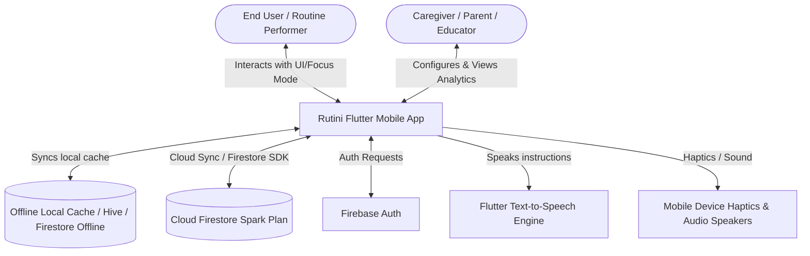
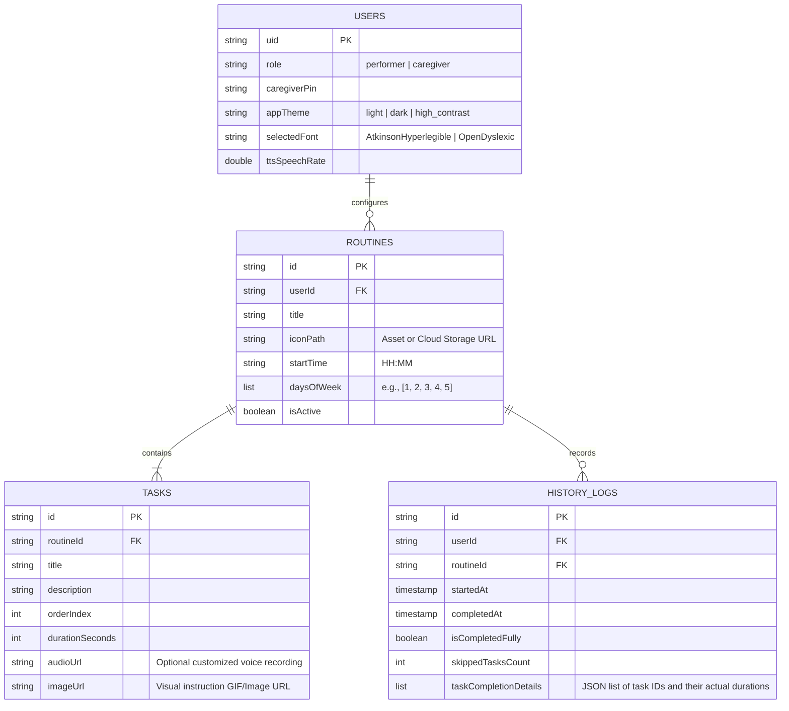
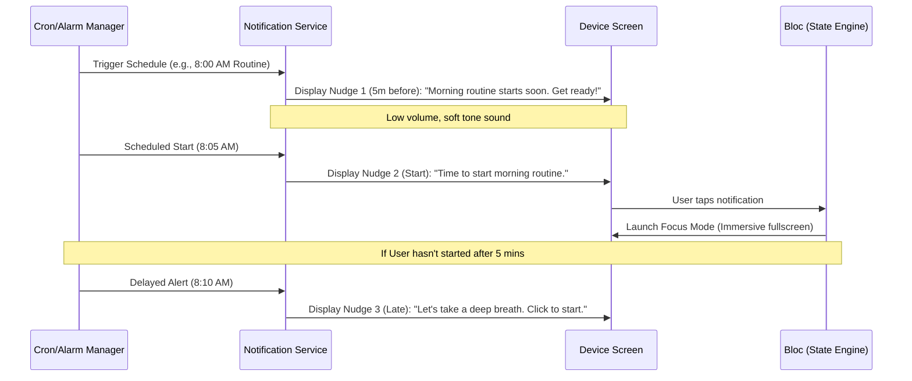
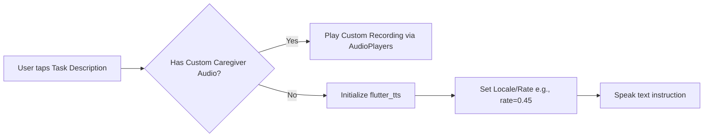

# Technical Design Document: Rutini
**Project Name**: Rutini  
**Theme**: Accessibility-First Routine & Task Planner for Cognitive/Neurodivergent Disabilities (ADHD, Autism, Dyslexia)  
**Target Platform**: Flutter Mobile (Android & iOS)  
**Target Backend**: Firebase (Spark Free Plan) with offline persistence  

---

## 1. System Overview & Vision

### 1.1. Background & Core Goal
For individuals with ADHD, Autism Spectrum Disorder (ASD), and Dyslexia, standard routine planners are often source of overwhelm rather than assistance. Existing apps are packed with visual noise, complex menus, and jarring notifications that trigger anxiety or distraction. 

**Rutini** is designed as a minimalist, accessibility-first routine execution and task-management application. It addresses executive dysfunction by:
1. Converting routines into **single-focus, visual, step-by-step tasks**.
2. Replacing anxiety-inducing alarms with a **gradual nudge pipeline**.
3. Incorporating **soothing haptic and auditory reinforcement**.
4. Syncing configuration and statistics seamlessly between the **End User** (the routine performer) and a **Caregiver** (parent or therapist) using Firebase.

### 1.2. System Context Diagram


---

## 2. User Requirements & Use Cases

### 2.1. User Personas
*   **The Performer (End User)**: Individuals with cognitive/learning differences who need to follow routines. They benefit from large text, audio playback, low-friction interactions, and high visual predictability.
*   **The Caregiver (Admin)**: Parents, guardians, or therapists who create routines, customize audio/visual visual instructions, and monitor completion rates without invading the user's focus space.

### 2.2. Functional Requirements
*   **FR-1: Immersive Focus Mode**: When executing a routine, the app must hide all system navigation, block visual distractions, and display exactly *one task at a time* in large, readable cards.
*   **FR-2: Self-Healing Active State**: If the app is closed, crashes, or gets backgrounded during a routine, it must resume *exactly* on the last active step upon reopening.
*   **FR-3: Gentle Nudge Notifications**: Reminders must be sent in a progressive pipeline (e.g., 5-minute pre-nudge, start nudge, gentle delay nudge) using localized, soft sounds rather than default ringtones.
*   **FR-4: Text-to-Speech (TTS) Integration**: Dyslexic and non-verbal users must be able to tap any instruction to hear it spoken aloud.
*   **FR-5: Caregiver Sync & Dashboard**: A separate dashboard view in the app (secured by PIN or biometric lock) allows caregivers to configure schedules, track routine success rates, and analyze trends.

### 2.3. Data Models & Database Schema

We will use Firestore as our primary database, configured for offline operation. The local database will match Firestore's model to ensure schema synchronization.



---

## 3. App Architecture (Flutter-centric)

To achieve high reliability, offline-first access, and absolute clean separation of concerns, the app follows the standard **BLoC (Business Logic Component)** pattern combined with a local repository layer.

### 3.1. Tech Stack Overview
*   **State Management**: `flutter_bloc` combined with `hydrated_bloc` for UI state persistence.
*   **Database**: **Cloud Firestore** for sync, with offline caching enabled. **Hive** (or **Isar**) for ultra-fast local key-value configs and notification scheduling data.
*   **Authentication**: **Firebase Authentication** (supporting anonymous login for fast onboarding, and Email/Google login for caregiver synching).
*   **Local Media Caching**: `cached_network_image` to ensure that custom instruction GIFs or icons are cached locally and load instantly.

### 3.2. Offline Persistence & Hydration Architecture

```
+-------------------------------------------------------------+
|                     Rutini Flutter App                      |
+-------------------------------------------------------------+
                            |
           +----------------+----------------+
           |                                 |
           v                                 v
+----------------------+           +-------------------+
|  HydratedBloc State  |           |   Firestore SDK   |
| (UI State / Progress)|           | (Repository Data) |
+----------------------+           +-------------------+
           |                                 |
           v                                 v
+----------------------+           +-------------------+
|     Local Storage    |           |  Offline Cache    |
| (Hydrated Storage)   |           |  (SQLite Backed)  |
+----------------------+           +-------------------+
```

#### Code Snippet: Firestore Offline Caching Initialization
```dart
import 'package:cloud_firestore/cloud_firestore.dart';

void initializeFirestore() {
  FirebaseFirestore.instance.settings = const Settings(
    persistenceEnabled: true, // Enables local caching on Android/iOS
    cacheSizeBytes: Settings.CACHE_SIZE_UNLIMITED, // Keeps history locally
  );
}
```

#### Code Snippet: Hydrated Bloc for Focus Mode state recovery
```dart
import 'package:hydrated_bloc/hydrated_bloc.dart';

class RoutineFocusState {
  final String activeRoutineId;
  final int currentTaskIndex;
  final bool isRunning;
  
  RoutineFocusState({
    required this.activeRoutineId,
    required this.currentTaskIndex,
    required this.isRunning,
  });

  Map<String, dynamic> toMap() {
    return {
      'activeRoutineId': activeRoutineId,
      'currentTaskIndex': currentTaskIndex,
      'isRunning': isRunning,
    };
  }

  factory RoutineFocusState.fromMap(Map<String, dynamic> map) {
    return RoutineFocusState(
      activeRoutineId: map['activeRoutineId'] ?? '',
      currentTaskIndex: map['currentTaskIndex'] ?? 0,
      isRunning: map['isRunning'] ?? false,
    );
  }
}

class RoutineFocusBloc extends HydratedBloc<RoutineFocusEvent, RoutineFocusState> {
  RoutineFocusBloc() : super(RoutineFocusState(activeRoutineId: '', currentTaskIndex: 0, isRunning: false));

  @override
  RoutineFocusState? fromJson(Map<String, dynamic> json) {
    return RoutineFocusState.fromMap(json);
  }

  @override
  Map<String, dynamic>? toJson(RoutineFocusState state) {
    return state.toMap();
  }
}
```

---

## 4. UI/UX Technical Guidelines (Accessibility)

Accessibility is the foundational constraint of the frontend. Every element must be verified against WCAG AA guidelines with special adjustments for neurodivergent cognitive models.

### 4.1. Typography
We use **Atkinson Hyperlegible** (designed by the Braille Institute to maximize readability) and **OpenDyslexic** as a selectable alternative.

*   **Implementation Rules**:
    - Avoid justified text (which creates distracting white spaces or "rivers" of space).
    - Maintain `lineHeight` of at least `1.5` and `letterSpacing` of at least `0.15`.
    - Never overlay text directly over busy background graphics without a solid backdrop container.

```dart
// Theme specification example
ThemeData buildA11yTheme(String fontFamily) {
  return ThemeData(
    fontFamily: fontFamily,
    textTheme: TextTheme(
      bodyLarge: TextStyle(
        fontSize: 18.0,
        height: 1.5,
        letterSpacing: 0.15,
        color: Colors.black87,
      ),
      headlineMedium: TextStyle(
        fontSize: 24.0,
        fontWeight: FontWeight.bold,
        letterSpacing: 0.2,
      ),
    ),
  );
}
```

### 4.2. Soothing Color Palette & High Contrast
*   **ADHD/Autism consideration**: Bright neon colors trigger visual fatigue and hyper-arousal. Rutini uses a muted, natural color palette (soft sages, pastel blues, and warm creams).
*   **High Contrast Mode**: A simple toggle swaps the theme to pure black, high-contrast white text, and thick borders for users with low vision or extreme sensory overstimulation.

| Element | Light Theme | Dark Theme | High Contrast |
| :--- | :--- | :--- | :--- |
| Background | `#FDFBF7` (Warm Bone) | `#121212` (Soft Dark) | `#000000` (Pure Black) |
| Primary Accent | `#3A6351` (Sage Green) | `#8FBC8F` (Pale Green) | `#FFFFFF` (Pure White) |
| Secondary Accent | `#E3B04B` (Soft Ochre) | `#E4B55E` (Muted Gold) | `#FFFF00` (Pure Yellow) |
| Cards / Borders | `#EBE3D5` / `#D4C5B9` | `#1E1E1E` / `#2D2D2D` | `#000000` / `#FFFFFF` |

### 4.3. Haptic & Auditory Feedback
To deliver positive dopamine feedback without triggering auditory startle responses:
*   **Vibrations**: We utilize short, precise haptic buzzes instead of continuous alarms.
    - Start task: Double light tap (`HapticFeedback.lightImpact()`)
    - Routine finished: Success pattern (three sequential medium haptic pulses)
*   **Audio cues**: Use short, low-frequency acoustic sounds (e.g., chime or wooden block tap) rather than high-pitched digital beeps.

---

## 5. Core Feature Workflows & Pipelines

### 5.1. Friendly Reminder Nudge Pipeline
The Nudge Pipeline uses local notifications to gently escalate warnings. 



### 5.2. Immersive Focus Mode Pipeline
Focus Mode utilizes Flutter’s system navigation configuration to block distractions.

```dart
import 'package:flutter/services.dart';
import 'package:wakelock_plus/wakelock_plus.dart';

class FocusModeController {
  static void enableFocusMode() {
    // Hide status bar and bottom navigation controls
    SystemChrome.setEnabledSystemUIMode(SystemUiMode.immersiveSticky);
    // Keep screen awake during routine execution
    WakelockPlus.enable();
  }

  static void disableFocusMode() {
    // Re-enable normal OS bars
    SystemChrome.setEnabledSystemUIMode(SystemUiMode.edgeToEdge);
    // Allow screen timeout
    WakelockPlus.disable();
  }
}
```

### 5.3. Text-to-Speech (TTS) & Caching Pipeline
Every visual instruction is backed by a cached audio/TTS stream, lowering the entry barrier for dyslexic individuals.



### 5.4. Future On-Device Pattern Analysis Architecture (TFLite Ready)
To support a smooth future integration of TensorFlow Lite for on-device habit analysis:
1.  **Analytical Database Records**: We log precise data for every routine run: timestamp, date, skipped task count, and individual task duration deviation.
2.  **Modular Provider Interface**: The logic for predicting skipped routines is isolated behind an abstract interface (`HabitPredictor`). This allows us to start with a simple **rule-based heuristic class** (e.g., alert if task is skipped 3 times in a row) and drop in a **Tensorflow Lite implementation** later without refactoring UI layers.

```dart
abstract class HabitPredictor {
  Future<List<String>> analyzeRoutineCompletion(List<HistoryLog> history);
}

// Rule-based heuristic used for MVP
class HeuristicHabitPredictor implements HabitPredictor {
  @override
  Future<List<String>> analyzeRoutineCompletion(List<HistoryLog> history) async {
    // Basic heuristic: check if any routine is skipped > 50% of the time in the last 7 days
    return ["Rinsing mouth task in Morning Routine is frequently skipped. Try moving it before brushing teeth."];
  }
}

// Future TFLite integration class
class TFLiteHabitPredictor implements HabitPredictor {
  @override
  Future<List<String>> analyzeRoutineCompletion(List<HistoryLog> history) async {
    // TODO: Load TFLite Model interpreter and input history vector
    return [];
  }
}
```

---

## 6. Tech Stack & Integration Matrix

### 6.1. Essential Packages (`pubspec.yaml`)
To build this robust technical model, the following core dependencies must be integrated:

```yaml
dependencies:
  flutter:
    sdk: flutter
    
  # State & Persistence
  flutter_bloc: ^8.1.3
  hydrated_bloc: ^9.1.3
  path_provider: ^2.1.2
  
  # Firebase Backend
  firebase_core: ^3.1.0
  firebase_auth: ^5.1.0
  cloud_firestore: ^5.0.1
  firebase_storage: ^12.1.0
  
  # Media & Accessibility
  flutter_tts: ^4.1.0
  audioplayers: ^6.0.0
  cached_network_image: ^3.3.1
  wakelock_plus: ^1.2.1
  
  # Notifications
  flutter_local_notifications: ^17.1.2
```

### 6.2. Firebase Spark Plan Limits & Cost Prevention
To ensure the app remains 100% free under the **Firebase Spark Plan**, our architecture enforces the following parameters:

*   **Firestore Read/Write Optimizations**:
    - Only write logs on routine *completion* or *termination*, not per step.
    - Keep a copy of routines and task assets in local SQLite/Hive caching so they don't count against Firestore daily read limits (50k free reads/day).
*   **Storage Limitations (5 GB maximum)**:
    - User uploaded images and recorded audios must be compressed on-device before uploading to Firebase Storage. 
    - Custom audio recordings: Compress to **AAC/M4A** (mono, low bit-rate).
    - Images: Compress to **JPEG/WebP** (800x800px max, 70% quality).

---

## 7. Figma Prototyping Checklist (Screen Maps)

Based on the functional workflows and technical architectures specified above, a total of **9 screens** must be designed in Figma to complete the application prototype.

### 7.1. Category A: Common Screens (2 Screens)
*   **Screen 1: Onboarding & Role Selection Screen**
    *   *Purpose*: Initial app launch screen allowing the user to select their role.
    *   *Design Requirement*: Minimalist design, bold and accessible tap targets for "Performer" vs. "Caregiver".
*   **Screen 2: Accessibility & Profile Settings Screen**
    *   *Purpose*: Configures custom user settings (defined in Section 4).
    *   *Design Requirement*: Clear toggles for Atkinson Hyperlegible / OpenDyslexic font selection, dark/light theme options, high contrast mode, and a slider for TTS speed rate control.

### 7.2. Category B: Performer Flow (3 Screens)
Designed with zero visual noise, soft colors (Section 4.2), and extra-large spacing to reduce anxiety.
*   **Screen 3: Performer Dashboard (Main Home)**
    *   *Purpose*: The entry screen for daily routines.
    *   *Design Requirement*: Large, visual cards showing the routine list for the current day. Features a secure caregiver lock button.
*   **Screen 4: Immersive Focus Mode Screen**
    *   *Purpose*: Single-task execution screen (Section 5.2).
    *   *Design Requirement*: Fullscreen layout with hidden status/navigation bars. Large task card containing instruction images/GIFs, a prominent TTS play icon button, a step progress bar (e.g. "Task 2 of 5"), and large "Done" and "Skip" action buttons.
*   **Screen 5: Routine Completion Screen**
    *   *Purpose*: Soft reward screen after completing all tasks.
    *   *Design Requirement*: Delightful but non-jarring visuals (e.g., warm celebration icon) and a button to return to the dashboard.

### 7.3. Category C: Caregiver Flow (4 Screens)
Administrative screens intended for caregivers, parents, or educators.
*   **Screen 6: Caregiver PIN Verification Screen**
    *   *Purpose*: Security gateway to administrative dashboards.
    *   *Design Requirement*: Clean numeric keypad dialog.
*   **Screen 7: Caregiver Dashboard (Control Center)**
    *   *Purpose*: Managing routine lists and schedules.
    *   *Design Requirement*: Clean layout showing routines with activate/deactivate switches, edit shortcut buttons, and navigation to analytics.
*   **Screen 8: Routine & Task Builder / Editor Screen**
    *   *Purpose*: Setup screen for creating routines and step-by-step tasks.
    *   *Design Requirement*: Form fields for Routine Name, Start Time, Icon picker, and active days. Contains a drag-and-drop list of tasks with media attachments (custom audio voiceover/GIF files).
*   **Screen 9: Caregiver Analytics & Insights Screen**
    *   *Purpose*: Monitors user's performance and habits (Section 5.4).
    *   *Design Requirement*: Clean completion rate calendars, activity charts, and an automated rule-based "Habit Suggestions Panel" pointing out skipped tasks.